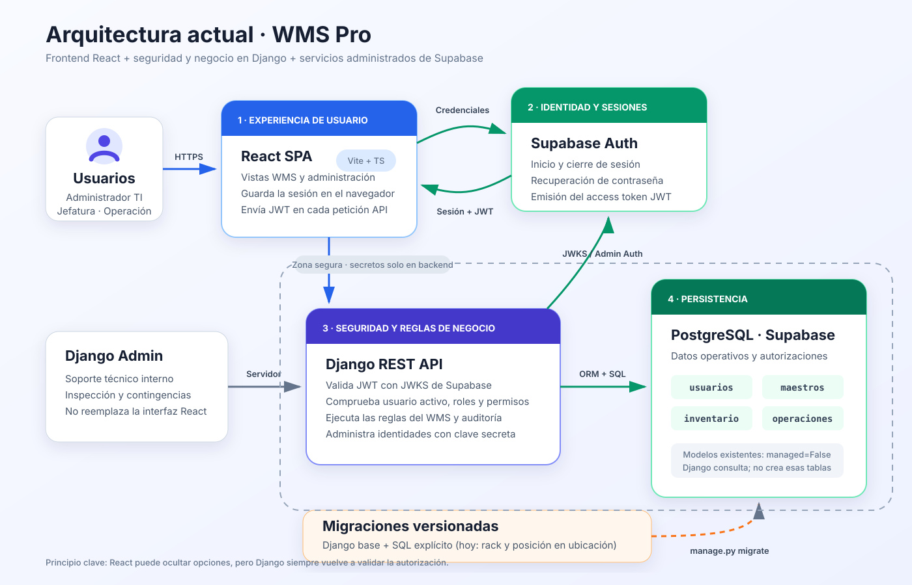

# Arquitectura del sistema



El diagrama representa la implementación actual de WMS Pro. Supabase Auth y
PostgreSQL son servicios diferentes dentro del mismo proyecto Supabase; Django
mantiene el control de autorización y reglas de negocio.

## Flujo principal

```text
React SPA -> Supabase Auth -> access token JWT
React SPA -> Django REST API -> Supabase PostgreSQL
                |
                +-> valida JWT con JWKS
                +-> verifica usuario activo
                +-> calcula roles y permisos
                +-> aplica reglas del WMS
```

## Responsabilidades

- Supabase Auth es la fuente de identidad y administra credenciales y sesiones.
- Django es la fuente de autorización y de todas las reglas de negocio.
- PostgreSQL almacena el perfil, roles, permisos y datos logísticos.
- React no contiene secretos ni decide si una operación está autorizada.
- Reportes y BI consultan las tablas operativas como fuente única y generan
  agregados y archivos bajo demanda, sin duplicar saldos de inventario.
- Planificación usa la ocupación actual como ancla y aplica eventos programados
  y ejecutados para producir series de capacidad; no altera reservas ni stock.

Los permisos mostrados en el frontend son informativos. Cada endpoint de
Django debe volver a comprobar la autorización correspondiente.

Las operaciones administrativas de identidad usan `SUPABASE_SECRET_KEY`
únicamente desde Django. La llave privilegiada nunca se envía al navegador.
Registro y edición aplican compensación entre Supabase Auth y PostgreSQL para
reducir el riesgo de identidades o perfiles desincronizados.

## Base de datos y migraciones

- Las migraciones estándar administran las tablas internas de Django.
- Los modelos de los esquemas `usuarios`, `maestros` e `inventario` existentes
  usan `managed = False`; Django los consulta, pero no crea esas tablas.
- Los cambios necesarios sobre esas tablas se versionan con migraciones SQL
  explícitas. EP-02 agrega `rack` y `posicion` a `maestros.ubicacion`; EP-03
  versiona recepción, documentos y lotes; EP-04 incorpora el estado y las
  referencias de origen/destino de los movimientos internos; EP-05 vincula
  cada línea de salida con su lote y garantiza un picking y un despacho únicos
  por pedido.
- Los comandos `bootstrap_access` y `bootstrap_master_catalogs` cargan datos
  iniciales y no sustituyen una migración estructural.

## Consistencia de inventario

Los traslados se registran primero como pendientes. La confirmación física se
ejecuta con bloqueos de fila y una transacción atómica: valida nuevamente el
saldo disponible, descuenta el origen, incrementa o crea el stock de destino y
registra usuario y fecha de confirmación. Los reempaques usan el mismo libro de
movimientos y crean pallets hijos ligados al pallet original.

En las salidas, la validación de stock crea reservas por ubicación. El cierre
del despacho bloquea pedido, reservas y existencias, comprueba que el picking
esté completo, consume las reservas y descuenta el inventario en una única
transacción. Si cualquiera de esas comprobaciones falla, no se aplica ningún
cambio parcial. La cancelación aplica el bloqueo inverso y libera las reservas
sin modificar el stock total. La selección de lotes expone una sugerencia FEFO
calculada desde existencias disponibles y fechas de vencimiento.
